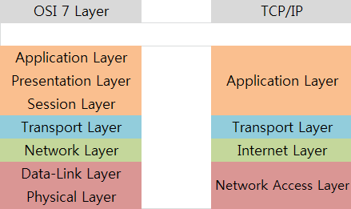

* Networking: 서로 연결하는 것.
* Internet: 여러개의 네트워크를 묶은 것.
* 네트워크 통신 방식 종류: Ethernet, TokenRing
  * Ethernet: 네트워킹의 방식 중 하나, CSMA/CD 프로토콜 사용.
    * Carrier Sense Multiple Access/Collision Detection
    * 대충 알아서 눈치로 통신하자라는 의미.
    * Carrier Sense: Carrier 감지
    * Multiple Access: 다중 접근
    * Colleision Detection: 충돌 감지
    * 감지후 유휴 상태면 전송, 동시에 전송하게되는경우 충돌발생, 충돌하면 대기후 또 발송 여러번 반복후 계속 충돌나면 포기.
    * 일반적인 속도 100/1,000Mbps
  * TokenRing: 
    * 하나의 네트워크에는 하나의 토큰이 있음을 전제로 토큰을 넘기면서 데이터 전송을하여 충돌이 발생하지 않음.
    * 일반적인 속도 4Mbps/16Mbps
* UTP(Unshielded Twisted Pair) 케이블
  * 보호되지않은, 두가닦에 한쌍인 케이블
  * Shielded 케이블(STP)은 전자기 간섭(Electro Magnetic Interference)를 감소할수 있으나 비쌈.
  * 카테고리 1~7
    * 카테고리1: 주로 전화망
    * 카테고리2: 최대 4Mbps 잘사용하지 않음
    * 카테고리3: 10 Base T 최대 10Mbps 전송
    * 카테고리4: 토큰링에서 사용. 최대 16Mbps
    * 카테고리5: 최대 100 Mbps
    * 카테고리5E: 최대 1 Gbps
    * 카테고리6: 최대 1 Gbps
    * 카테고리 6a: 최대 10 Gbps
* MAC Address(Media Access Control) - 2계층
  * IP를 MAC 주소로 바꾸는 절차 : ARP
  * 발신측에서 브로드캐스트로 동일 대역의 pc에게 신호를 보내면 대상pc가 자신의 mac주소를 발신측에 보내고 통신을 하게됨.
  * 중간에 라우터가 끼면 라우터가 라우터의 mac를 발신측에 전달하고 다른 라우터로 신호를 보냄.
  * 6옥탯으로 구성(48bit), 24 bit는 제조자 코드, 24bit는 일련번호.
* Open Systems Interconnection 7 Layer
  |Layer|translation unit|-|device|protocol|
  |---|---|---|---|---|
  |Application Layer|||||
  |Presentation Layer|||||
  |Session Layer|stream|||||
  |Transport Layer|segment, datagram(udp)|port|L4 loadbalancer|TCP/UDP|
  |Network Layer|packet|ip address|L3 switch, router||
  |Data Link Layer|frame|mac address|switch, bridge||
  |Physical Layer|bit||cable, hub, repeater||
* 프로토콜
  * 컴퓨터간 인터넷을 사용하기위한 규약.
  

* 버스
  * 컴퓨터에서 데이터가 날아다니는 길.
  * pc의 버스에따라 선택하는 nic의 종류가 달라짐.

* 전송속도
  * 10Mbps: 10,000,000bit: 1,250,000 byte: 1mb/sec
* STP 알고리즘
  * 스위치나 브리지에서 발생할 수 있는 루핑을 막기위해 두개 이상의 경로가 연결되면 하나를 제외하고 나머지 경로를 자동으로 막아두었다가 기존 경로에 문제가 생기면 막아놓은 경로를 풀어서 데이터를 전송하는 알고리즘.
  